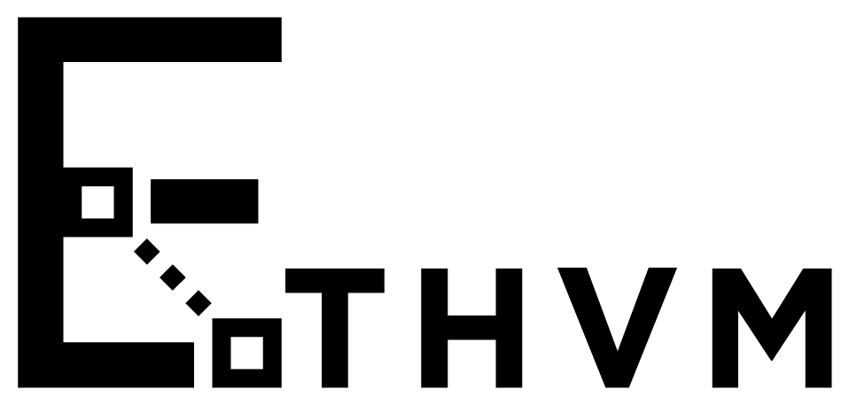

# BOUNTY: Create Tx Reciept Event Logs
## Overview
Logs?? Logs bloom?? What are they? Why do we need them, how can we interpret them and visualize them? This is the problem you’ll be solving. Create UI elements necessary to display and decode transaction logs. This bounty relates to MEW's block explorer [EthVM.com](https://www.ethvm.com/). It's front-end code base can be found [here](https://github.com/EthVM/EthVM).

## Reward: $1,000
The reward will be split between in-person and virtual contestants.

## Specs:
The main requirement is to use the `getTransactionByHash()` query provided by our [GraphQL API](https://api.ethvm.com/) and to retrieve transaction details, including its logs. You can choose to create a separate web app or you can use our block explorer and implement it directly within the transaction's details page. There are several ways to decode event topics:
- You can directly look up contract signatures in metadata.json in our [verified contracts repository](https://github.com/EthVM/evm-source-verification/tree/main/contracts/1)
- You can use events.json file from one of our [repositories](https://github.com/EthVM/eth4ByteDirectory).

` getTransactionByHash()`:
Returns a transaction matching the given transaction hash.

|Param | Type | Desc
| ------ | ------ | ------ |
|hash| string | transaction hash |

_Example:_

```
query{
  getTransactionByHash(hash: "0xb2b94dd403d4a2879ee9ecea055ace40c80a34d5d563006803e94cc6298cb457"){
    logs{
      address
      data
      topics
      logIndex
      id
      removed
      type
    }
  }
}
```
If you are using the [block explorer front-end](https://github.com/EthVM/EthVM), you will need to add a `.env` file in the `/newclient` directory for it to work properly during development with the following content:
```
VUE_APP_PUBLIC_URL='www.ethvm.com/'
VUE_APP_HTTP_LINK=https://api.ethvm.com
VUE_APP_WS_CLIENT=wss://apiws.ethvm.com
VUE_APP_OPENSEA_API = https://nft.mewapi.io
VUE_APP_SENTRY_SECURITY_DSN=''
VUE_APP_ETH_NETWORK=''
```
## Judging Criteria
- Creativity (30%) — How original and novel the submission is.
- Technical Difficulty and Accuracy (30%) — How clean and accurate the the implementation is.
- User Experience (40%) — How intuitive and understandable the feature implementation is for potential users.

## Submission
To submit your implementation, create a pr to the EthVM block explorer. If you are making a separate web app, you can directly put your app folder in the core next to the newclient folder, otherwise you can directly edit base code.
