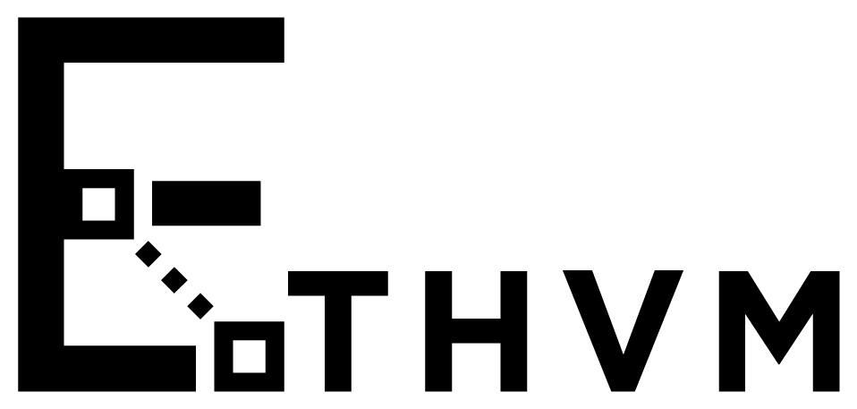

# BOUNTY: Decode Tx
## Overview
It has always been tricky to see exactly what happened in an Ethereum transaction. EthVM API provides the traces; however, there is no intuitive way to display it to human beings who aren’t hardcore developers. Let’s change that; let’s depict traces in a creative and visual way so anyone can understand it. This bounty relates to MEW's block explorer [EthVM.com](https://www.ethvm.com/). It's front-end code base can be found [here](https://github.com/EthVM/EthVM). 

## Reward: $4,000
The reward will be split between in-person and virtual contestants.

## Specs:
The main requirement is to use the `getTransactionByHashWithTraces()` query provided by our [GraphQL API](https://api.ethvm.com/) and to retrieve transaction details, including its logs and traces. You can choose to create a separate web app or you can use our block explorer source code and implement it directly within the transaction's details page. Please note, **DO NOT** use the normal `getTransactionByHash()` query, as it will not return trace results for most recent transactions.

`getTransactionByHashWithTraces()`:
Returns a transaction matching the given transaction hash.

|Param | Type | Desc
| ------ | ------ | ------ |
|hash| string | transaction hash |

_Example:_

```
query{
  getTransactionByHashWithTraces(hash: "0x0000004fb6cc5ac4afe5f7dff67971f79e88d57c519daf3e94707e9563874541"){
  trace {
    action{
      callType
      from
      gas
      input
      to
      value
    }
    result {
      gasUsed
      output
    }
    subtraces
    traceAddress
    transactionPosition
    type
    
  }
  }
}
```

If you are using the [block explorer front-end](https://github.com/EthVM/EthVM), you will need to add a `.env` file in the `/newclient` directory for it to work properly during development with the following content:
```
VUE_APP_PUBLIC_URL='www.ethvm.com/'
VUE_APP_HTTP_LINK=https://api.ethvm.com
VUE_APP_WS_CLIENT=wss://apiws.ethvm.com
VUE_APP_OPENSEA_API = https://nft.mewapi.io
VUE_APP_SENTRY_SECURITY_DSN=''
VUE_APP_ETH_NETWORK=''
```
## Judging Criteria
- Creativity (30%) — How original and novel the submission is.
- Technical Difficulty and Accuracy (30%) — How clean and accurate the the implementation is.
- User Experience (40%) — How intuitive and understandable the feature implementation is for potential users.

## Submission
To submit your implementation, create a pr to the EthVM block explorer. If you are making a separate web app, you can directly put your app folder in the core next to the newclient folder, otherwise you can directly edit base code.
